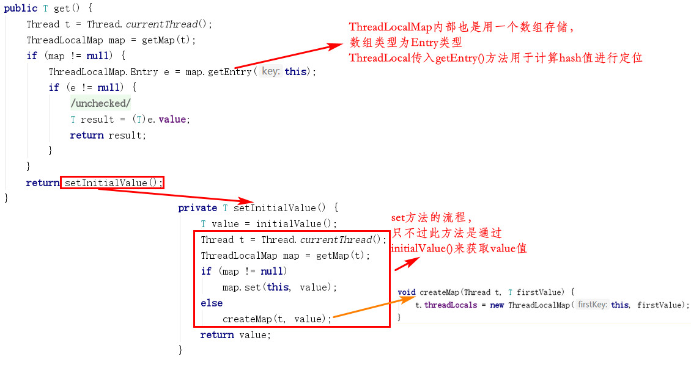

#### 1. 类的关系


- 每个Thread都包含一个ThreadLocalMap变量（以ThreadLocal为键，value为值），即Thread和ThreadLocal是一对多的关系

- ThreadLocal的hash值为threadLocalHashCode域变量，创建ThreadLocal对象时自动产生，其唯一性由AtomicInteger变量来保证

- ThreadLocalMap的索引定位，扩容与HashMap高度类似

#### 2. ThreadLocal.get() 流程

1. 获取到当前线程的ThreadLocalMap
2. 传入当前ThreadLocal的键值，返回对应的value值
3. 若获取到的为Null，则调用setInitialValue方法



initialValue()方法默认返回null，不手动set值时，需要覆盖（否则在set时，会空指针异常）

#### 3. 应用场景

**数据库连接：**

```java
private static ThreadLocal<Connection> connectionHolder = new ThreadLocal<Connection>() {
    public Connection initialValue() {
        return DriverManager.getConnection(DB_URL);
    }
};

public static Connection getConnection() {
	return connectionHolder.get();
}
```

每一个线程都有一个Connection

**Session管理：**

```java
private static final ThreadLocal threadSession = new ThreadLocal();

public static Session getSession() throws InfrastructureException {
    Session s = (Session) threadSession.get();
    try {
        if (s == null) {
            s = getSessionFactory().openSession();
            threadSession.set(s);
        }
    } catch (HibernateException ex) {
        throw new InfrastructureException(ex);
    }
    return s;
}
```

#### 4. ThreadLocal的内存泄露问题

实线表示强引用，虚线表示弱引用：


```java
static class Entry extends WeakReference<ThreadLocal<?>> {
        /** The value associated with this ThreadLocal. */
        Object value;

        Entry(ThreadLocal<?> k, Object v) {
            super(k);
            value = v;
        }
    }
```
- ThreadLocalMap使用ThreadLocal的弱引用作为key，如果一个ThreadLocal没有外部强引用引用他，那么系统gc的时候，这个ThreadLocal势必会被回收，这样一来，ThreadLocalMap中就会出现key为null的Entry，就没有办法访问这些key为null的Entry的value，如果当前线程再迟迟不结束的话，这些key为null的Entry的value就会一直存在一条强引用链, 永远无法回收，造成内存泄露。

所以在设计上，防止了此类问题：

在hash定位过程中，若发现某个Entry的key为null，会将此Entry擦除，消除value的强引用，Object自然会被回收，但这前提是得触发hash过程。所以，很多情况下需要使用者手动调用ThreadLocal的remove函数（该函数内会通过key找到Entry值，将Entry擦除），手动删除不再需要的ThreadLocal，防止内存泄露