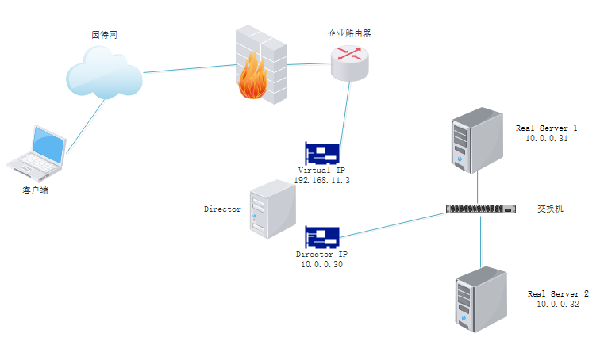
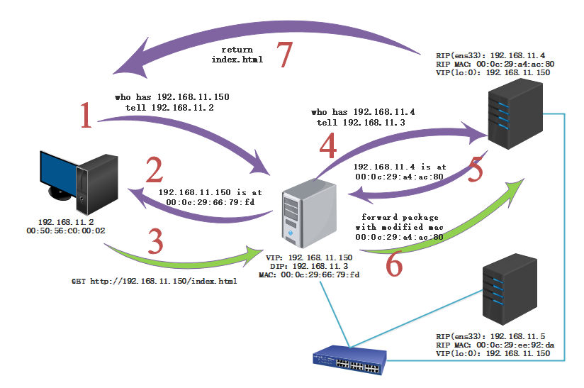

参考：[https://www.sharpcode.cn/linux/linux-virtual-server/](https://www.sharpcode.cn/linux/linux-virtual-server/)

[TOC]

# NAT模式

nat工作模式：

- 客户端向Director的virtual IP发送请求
- Director根据设定好的规则匹配（一条规则通常包含ip地址、端口和协议三个部分）能匹配则按LVS策略转发数据给后端真实服务器
- Real Server把响应发送给Director，Director把源IP地址设置为自己的Virtual IP，然后发送给客户端

nat模式的缺点：

无论是请求数据还是响应数据，都会经过Director服务器处理，这就对Director服务器的配置要求非常之高。而且网络流量都集中在Director身上，造成网络资源的不合理利用。

**两台Real Server的网关必须指向Director的Director IP**

# DR模式

和nat模式不同的是，DR模式当中只有请求会经过Director，所有对客户端的响应由Real Server自己返回。好处是减轻Director的负载。

在这个模式当中，Director的工作流程如下：

- 接收客户端的请求
- 选择合适的Real Server，假设选择了Real Server 1
- 把接收到的数据帧中的dst（destination） MAC地址修改为Real Server 1的MAC地址
- 把数据转发给Real Server 1

**DR模式中三个重要问题：**

- 为什么每个Real Server都必须有VIP
  - Real Server要处理接收到的数据，就必须有这个VIP
- VIP为什么配置在本地回环（loopback）网络上
  - loopback设备是一个本地设备，它对外是不可见的，既不发送arp请求，也没有arp响应，配合arp_ignore内核参数，可以确保客户端的请求被发往Director服务器，而不是Real Server上
- lo:0的掩码为什么是255.255.255.255
  - 如果将掩码设为255.255.255.0，那么表示lo:0和RIP处于同一子网，在数据返回的时候会优先选择lo:0，结果是数据返回失败，而掩码255.255.255.255可以区别出VIP和RIP是两个不同的子网，因此数据就能正确返回到客户端