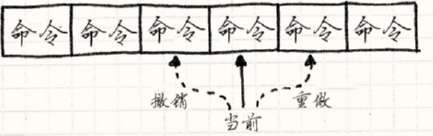

# 游戏编程模式（二）：命令模式和享元模式

**命令模式**

​	命令模式在GoF中有个晦涩的定义：

```
将一个请求封装为一个对象，从而使你可用不同的请求对客户进行参数化；对请求排队或记录请求日志，以及支持可撤销的操作。
```

​	高度抽象的定义加上蹩脚的翻译使其难懂，接下来会使用一些代码案例描述我们开发过程中可能遇到的场景，并展示解耦的**过程演化**。

**一.**

​	在实现人物控制的功能时，简单的实现会是：

```c++
void InputHandler::handleInput()
{
    if (isPressed(BUTTON_X)) jump();
    else if (isPressed(BUTTON_Y)) fireGun();
    ...
}
```

**二.**

​	游戏中一般会有配置按键的功能，这时就要求类似jump()这种方法调用转变为可变换的东西，自然我们会将其用一个对象来表示，这时我们就进入了命令模式，用一个**Command**类来作为基类，将类似jump()这种游戏行为都定义为一个子类：

```c++
// 定义子类
class JumpCommand : public Command
{
public:
    virtual void execute() { jump(); }
};
class FireCommand : public Command
{
public:
	virtual void execute() { fireGun(); }
};

class InputHandler
{
public:
    void handleInput();
    // 绑定命令的方法……
private:
    Command* buttonX_;
    Command* buttonY_;
    ...
};

void InputHandler::handleInput()
{
    if (isPressed(BUTTON_X)) buttonX_->execute();
    else if (isPressed(BUTTON_Y)) buttonY_->execute();
    ...
}
```

​	此时就可以通过改变各个button变量的值来改变按键的设置。

**三.**

​	jump()这些行为方法一般会与某个玩家角色进行关联，但是我们不应该让方法去找它们控制的角色，而是应将角色对象作为参数传进去：

```c++
class JumpCommand : public Command
{
public:
    virtual void execute(GameActor& actor)
    {
    	actor.jump();
    }
};
```

​	这样做的好处就是可以灵活控制任意的角色，只需要传入不同的角色对象。但此时需要把actor角色对象与handleInput()方法进行解耦，把execute()的执行放到外面去：

```c++
Command* InputHandler::handleInput()
{
    if (isPressed(BUTTON_X)) return buttonX_;
    if (isPressed(BUTTON_Y)) return buttonY_;
    ...
}

Command* command = inputHandler.handleInput();
if (command)
{
	command->execute(actor);
}
```

**四.**

​	在典型的回合制策略游戏中，一般会有回滚这一概念，可以撤销或者重做玩家不喜欢的操作。命令模式完美地提供了这一问题的解决方案。

​	比如，在实现移动某个单位的功能时，代码可能如下：

```C++
class MoveUnitCommand : public Command
{
public:
	...
    virtual void execute()
    {
    	unit_->moveTo(x_, y_);
    }
private:
    Unit* unit_;
    int x_, y_;
};
```

​	这里的命令更特殊，将x，y作为成员变量，这意味着控制代码会在玩家做出操作时创造一个实例：

```c++
Command* handleInput()
{
    Unit* unit = getSelectedUnit();
    if (isPressed(BUTTON_UP)) {
        // 向上移动单位
        int destY = unit->y() - 1;
        return new MoveUnitCommand(unit, unit->x(), destY);
    }
    if (isPressed(BUTTON_DOWN)) {
        // 向下移动单位
        int destY = unit->y() + 1;
        return new MoveUnitCommand(unit, unit->x(), destY);
    }
    // 其他的移动……
    return NULL;
}	
```

​	在此基础上，可以增加一个记录移动之前位置的变量，来达到撤销操作的目的：

```c++
class MoveUnitCommand : public Command
{
public:
    ...
    virtual void execute()
    {
        // 保存移动之前的位置
        xBefore_ = unit_->x();
        yBefore_ = unit_->y();
        unit_->moveTo(x_, y_);
    }
    virtual void undo()
    {
    	unit_->moveTo(xBefore_, yBefore_);
    }
private:
    Unit* unit_;
    int xBefore_, yBefore_;
    int x_, y_;
};
```

**五.**

​	撤销和重做是一对正反操作，实现类似软件中的撤销列表和重做列表，只需将其维护成一个链表：

​	

**享元模式**

​	享元模式非常简单，简单提一下。	

​	游戏开发中，如果要呈现一片巨大的森林，成千上万的树，每棵树都由上千的多边形组成，在不做任何优化的情况下，可以就是每秒送到GPU六十次的百万个多边形。

**一.**	

​	定义一个树看起来会是：

```C++
class Tree
{
private:
    Mesh mesh_;  //多边形网格
    Texture bark_; 
    Texture leaves_; //树皮、树叶纹理
    Vector position_; //位置
    double height_;
    double thickness_; //高度厚度
    Color barkTint_;
    Color leafTint_; //颜色
};
```

**二.**	

​	享元模式简单到甚至不需要去知道有这么个设计模式，自然地就会把它用在代码中。GoF称之为固有状态，即上下文无关的部分，剩余部分是变化状态，那些每个实例独一无二的东西。在这个例子中，是每棵树的位置，高度和颜色：

```C++
class TreeModel
{
private:
    Mesh mesh_;
    Texture bark_;
    Texture leaves_;
};

class Tree
{
private:
    TreeModel* model_; //所有树共用一个模型实例
    Vector position_;
    double height_;
    double thickness_;
    Color barkTint_;
    Color leafTint_;
};
```

​	拓展一下，多数情况下不会在一开始就创建所有享元，当你需要一个时，一般会先检查是否已经创建了一个相同的实例，这通常意味着需要将构造函数封装在检查实例是否已经存在的接口之后，这也许会用到**工厂方法**。

​	为了返回一个已有的享元，通常需要一个存储它们的地方，使用**对象池**会是一个好办法。

​	在**状态模式**（会在接下来的章节中总结）中，经常会出现一些没有任何“独一无二”字段的状态对象，这时享元模式会派上用场。
